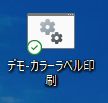
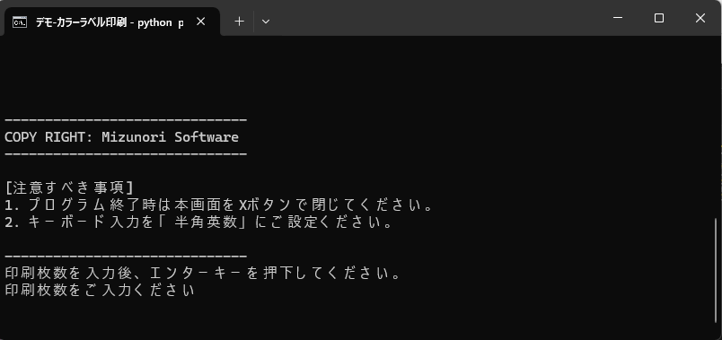

### ZT230TA カラーラベル デモガイド

</br>

1. デスクトップのアイコンを実行する。

    

    </br>

1. デモプログラムが起動される。
    
    
    </br>

1. 印刷枚数を半角で入力し、エンターを押下する。

    ```

    [注意すべき事項]
    1. プログラム終了時は本画面をXボタンで閉じてください。
    2. キーボード入力を「半角英数」にご設定ください。

    ------------------------------
    印刷枚数を入力後、エンターキーを押下してください。
    印刷枚数をご入力ください  1 [エンター] 
    ```
    </br>

1. 入庫した枚数分、カラーラベルが印刷される。

    </br>
